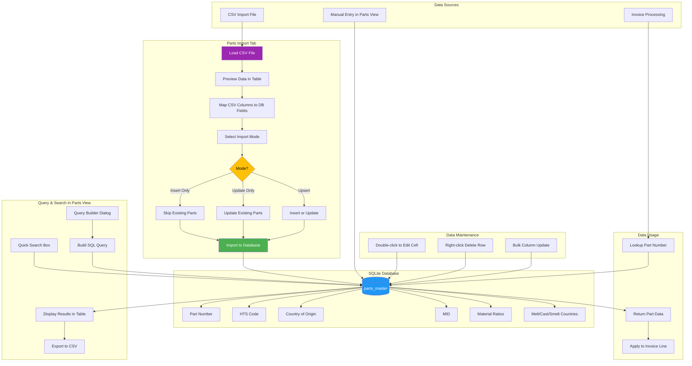

# Parts Master Data Flow

> ⚠ **Imported from internal 1.x line.** Schema fields shown (e.g. `country_of_smelt_secondary`, `pga_code`, `Sec301_Exclusion_Tariff`) reflect the v1.6.x parts_master. The current 0.1.x OSS build may have a narrower schema — see [CHANGELOG.md](../../CHANGELOG.md).

This flowchart shows how parts data is managed, imported, and used throughout the application.

## Data Structure

### Parts Master Table Fields
| Field | Description | Used For |
|-------|-------------|----------|
| part_number | Unique part identifier | Primary lookup key |
| hts_code | Harmonized Tariff Schedule code | Duty calculation |
| qty_unit | CBP quantity unit for this part | Qty1 in ACE worksheet |
| country_of_origin | Country where product originated | CBP declaration |
| mid | Manufacturer ID | Customs identification |
| client_code | Customer/client identifier | User access filtering |
| steel_pct | Percentage of entered value that is steel | Section 232 steel duty base |
| aluminum_pct | Percentage of entered value that is aluminum | Section 232 aluminum duty base |
| copper_pct | Percentage of entered value that is copper | Section 232 copper duty base |
| wood_pct | Percentage of entered value that is wood | Section 232 wood duty base |
| auto_pct | Percentage classified as automotive | Section 232 auto duty base |
| non_steel_pct | Residual non-Sec-232 percentage | Drives cast iron 9903.82.01 routing (v1.6.15) — when ≥100 with all metals 0, routes to zero-metal heading |
| country_of_melt | Country where steel was originally melted and poured | Section 232 steel declaration |
| country_of_cast | Country of most recent aluminum cast | Section 232 aluminum declaration |
| country_of_smelt | Primary country where aluminum was smelted | Section 232 aluminum declaration |
| country_of_smelt_secondary | Secondary country of aluminum smelt | Section 232 aluminum declaration |
| Sec301_Exclusion_Tariff | Section 301 exclusion code/rate | Reduce or eliminate 301 duty |
| pga_code | PGA (Partner Government Agency) code | Entry filing compliance |

## Parts Import Tab

The Parts Import tab provides a dedicated interface for bulk importing parts data:

1. **Load CSV File** - Click "Load CSV" to select a file
2. **Preview Data** - View the CSV data in a table before importing
3. **Map Columns** - Use the Column Mapping section to match CSV columns to database fields
4. **Select Import Mode**:
   - **Insert Only** - Only add new parts, skip existing part numbers
   - **Update Only** - Only update existing parts, skip new part numbers
   - **Upsert** - Insert new parts and update existing parts
5. **Import** - Click "Import Parts" to execute the import

## Parts View Tab

The Parts View tab provides full CRUD operations:

### Quick Search
- Type in the search box to filter by any field
- Results update as you type

### Query Builder
- Click "Query Builder" button for advanced searches
- Build complex queries with multiple conditions
- Combine conditions with AND/OR logic
- Export query results to CSV

### Editing Data
- **Edit**: Double-click any cell to edit in place
- **Add Row**: Right-click > Add Row
- **Delete Row**: Right-click > Delete Row
- **Bulk Update**: Select column, enter value, apply to all visible rows
