# OCRMill Template Processing

This flowchart shows the PDF processing pipeline from file drop to direct XLSX export.

```mermaid
flowchart TD
    subgraph Input["1. Input Phase"]
        A[User Drops PDFs / XLSX / ZIPs\nonto OCRMill Panel] --> B[Validate Files]
        B --> C{pdfplumber text\nextraction succeeds?}
        C -->|0 chars OR\n>50%% pages empty| D[OCR Fallback v1.4.0\nTesseract via PyMuPDF render]
        C -->|Text extractable| E[Queue Files for Extraction]
        D --> D1{OCR produced text?}
        D1 -->|Yes| E
        D1 -->|No| D2[Warn User: cannot extract\nfrom this PDF]
    end

    subgraph Parallel["2. Parallel Extraction — ThreadPoolExecutor"]
        E --> F1[Extract PDF 1]
        E --> F2[Extract PDF 2]
        E --> F3[Extract PDF N]
        F1 --> G1[Template Scoring]
        F2 --> G1
        F3 --> G1
    end

    subgraph Template["3. Template Matching"]
        G1 --> H{Check Template Cache}
        H -->|Last template confidence > 0.8| I[Use Cached Template]
        H -->|Cache miss| J[Score All Templates]
        J --> K[Select Best Match]
        I --> L[Run extract_all]
        K --> L
        L --> M[Line Items + Invoice Meta]
        L --> N{Section 232 Forms Present?}
        N -->|Yes| O[Parse 232 Tables\naluminum_pct, steel_pct,\ncountry fields per SKU]
        N -->|No| P[Continue]
        O --> P
    end

    subgraph MIDResolve["3.5 MID Resolution"]
        P --> P1{All rows have MID\nfrom template?}
        P1 -->|Yes| Q
        P1 -->|No - some missing| P2[MID Required Dialog v1.6.17\nType-to-filter completer\nfallback to available_mids]
        P2 --> P3{User Applies MID?}
        P3 -->|Apply| P4[Fill MID into unresolved rows]
        P3 -->|Skip| P5[Leave MID empty\nflag for post-export fixup]
        P4 --> Q
        P5 --> Q
    end

    subgraph MissingParts["4. Missing Parts Pre-flight"]
        Q[Collect All Items from All Files] --> R{Skip-missing-parts\ndialog enabled? v1.6.12}
        R -->|Yes| RA[Export with ReviewFlag column\nset to INCOMPLETE / NOT_IN_DB]
        R -->|No| R1{Unknown Parts Found?}
        R1 -->|Yes| S[Show Batch Missing Parts Dialog\nOne dialog covers all files]
        S --> T{User Adds Parts?}
        T -->|Yes| U[Save to parts_master]
        T -->|Skip| V[Flag as not_in_db]
        U --> W[Continue]
        V --> W
        R1 -->|No| W
        RA --> W
    end

    subgraph Enrichment["5. Enrichment Pipeline — Per File"]
        W --> X[parts_master Lookup]
        X --> Y[HTS Code + Qty Unit Lookup]
        Y --> Z[Country Normalization - ISO 2-letter]
        Z --> AA[Material Split Calculation]
        AA --> AAa[Weight Allocation\n- prefer item.net_weight per row\n- else value-proportional from doc total]
        AAa --> AB[Section 232 / 301 / 122 Routing\nCh99Heading, Sec122HTS, DualDeclaration]
        AB --> AC[InvoiceUOM Normalization]
        AC --> AD[CustomerRef / PO Mapping]
    end

    subgraph Export["6. Direct XLSX Export"]
        AD --> AE[Apply Output Profile Column Order]
        AE --> AF{Network Path?}
        AF -->|Yes| AG[Write with 3-attempt Retry\n1s delay between attempts]
        AF -->|No| AH[Write to Output Folder]
        AG --> AI[Move PDF to Processed Folder]
        AH --> AI
    end

    subgraph Summary["7. Validation Summary"]
        AI --> AJ[Emit Validation Summary]
        AJ --> AK[Log: file count, row count,\nHTS hit rate, unresolved countries,\nnot-found/incomplete parts]
        AK --> AL{Section 232 Data Found?}
        AL -->|Yes| AM[Show Section 232 Confirmation Dialog\nSKU, current vs new %, country fields]
        AM --> AN{User Confirms?}
        AN -->|Yes| AO[Write aluminum_pct, steel_pct,\ncountry_of_smelt, country_of_smelt_secondary,\ncountry_of_cast, country_of_melt\nto parts_master]
        AN -->|Cancel| AP[Skip DB Update]
        AL -->|No| AQ[Done]
        AO --> AQ
        AP --> AQ
    end

    style A fill:#4CAF50,color:#fff
    style AQ fill:#4CAF50,color:#fff
    style D fill:#F44336,color:#fff
    style S fill:#FF9800,color:#fff
    style AM fill:#9C27B0,color:#fff
    style C fill:#FFC107,color:#000
    style R fill:#FFC107,color:#000
    style AL fill:#FFC107,color:#000
    style AN fill:#FFC107,color:#000
```



## Pipeline Stages

### 1. Input Validation
- User drops one or more PDF, XLSX, XLS, or ZIP files onto the OCRMill panel
- pdfplumber attempts text extraction first
- **OCR fallback (v1.4.0)**: if pdfplumber returns empty text OR more than 50% of pages contain no extractable text, Tesseract OCR runs automatically. Page images are rendered via PyMuPDF and OCR'd; results are cached to `<pdf>.ocr.<hash>.txt`
- If OCR is unavailable (Tesseract not installed) AND pdfplumber returned nothing, the user is warned and the file is skipped

### 2. Parallel Extraction
- All PDFs are dispatched to a `ThreadPoolExecutor(max_workers=4)` simultaneously
- Each worker calls `ProcessorEngine.process_pdf()` independently
- Results are collected into a dict keyed by PDF path
- Extraction errors are logged per-file and do not abort the batch

### 3. Template Matching
- `ProcessorEngine` maintains `_last_template_name` as a cache
- If the cached template scores > 0.8 on the new document, it is used immediately (no full scoring round)
- On cache miss, all registered templates are scored via `get_confidence_score(text)` and the highest scorer wins
- `extract_all(text, tables)` returns `(invoice_number, project_number, line_items)`
- If the template exposes `_section_232_updates`, the processor accumulates those into `_last_section_232`

### 4. Missing Parts Pre-flight
- After all extractions complete, all part numbers are checked against parts_master
- A single "Add Missing Parts" dialog is shown once for the entire batch
- After the user saves parts, enrichment runs fresh against the updated database
- Parts not added are tagged `_not_in_db` in the enriched DataFrame

### 5. Enrichment Pipeline
- **parts_master lookup**: Retrieves HTS code, qty_unit, material percentages, country fields, MID
- **HTS units**: CBP quantity unit from `hts_units` table (Qty1); InvoiceUOM normalized to CBP codes for Qty2
- **Country normalization**: Full country names → ISO 2-letter codes via `country_codes` DB table
- **Material splits**: Splits entered value into sub-lines by steel/aluminum/copper/wood/auto percentages
- **Weight allocation** (v1.6.17): `calculate_weights` prefers template-provided per-item `net_weight` (used by multi-invoice templates like `sigmac_karmen` to allocate per-invoice). Falls back to value-proportional allocation of the document net weight. NA-safe coercion prevents crashes on documents with missing prices.
- **Section 232 / 301 / 122 routing**: Each row gets `Ch99Heading` + `Ch99Rate` + `Sec122HTS` per the rules in [flowchart 04](04_section_232_301_tariff_detection.md). `Sec301_Exclusion_Tariff` applied where present; `DualDeclaration` flag set when both steel and aluminum content > 0.
- **CustomerRef**: Template `po_number` per item → mapped to CustomerRef column in output

### 6. Direct XLSX Export
- Output columns ordered by the selected Output Profile
- `DualDeclaration` and other computed columns only written if explicitly in the profile
- Network (UNC) paths: 3-attempt write retry with 1-second delay; temp file preserved on final failure
- After successful export, Net Weight and MID fields in the UI are reset for the next file

### 7. Validation Summary & Section 232 Confirmation
- `validation_summary` PyQt signal emits a dict with: file_count, row_count, hts_hits, hts_misses, parts_not_found, unresolved_countries, section_232_updates
- Log panel displays a formatted summary block
- If `section_232_updates` is non-empty, a confirmation dialog shows a table of SKU → {current value, new calculated value} for aluminum_pct, steel_pct, and all country fields
- On confirmation, values are written to `parts_master`

## Template Development

Templates inherit from `BaseTemplate` (`templates/base_template.py`) and are auto-discovered at startup.

### Required Methods
| Method | Description |
|--------|-------------|
| `can_process(text)` | Returns True if this template can handle the document |
| `get_confidence_score(text)` | 0.0–1.0 confidence; highest scorer wins |
| `extract_line_items(text)` | Returns list of item dicts |
| `extract_invoice_number(text)` | Returns invoice number string |
| `extract_project_number(text)` | Returns PO/project number (or "UNKNOWN") |

### Optional Overrides
| Method | Description |
|--------|-------------|
| `extract_all(text, tables)` | Override to access raw table data (e.g., Section 232 forms) |
| `post_process_items(items)` | Add MID, normalize fields after extraction |
| `is_packing_list(text)` | Return True to skip document; MUST return False if "commercial invoice" present |

### Section 232 Template Pattern
```python
def extract_all(self, text, tables=None):
    invoice_number, project_number, items = super().extract_all(text, tables)
    self._section_232_updates = {}
    if tables:
        self._section_232_updates = self._parse_section_232_tables(tables)
    return invoice_number, project_number, items
```

`_section_232_updates` structure:
```python
{
    "2172347": {
        "aluminum_pct": 12.45,
        "steel_pct": 0.0,
        "country_of_smelt": "CN",
        "country_of_smelt_secondary": "",
        "country_of_cast": "CN",
        "aluminum_kg": "42.5"
    }
}
```

### Key Regex Conventions
- Use `.*?` (not `.+?`) for description fields — pdfplumber may place descriptions on previous lines
- Use `\s*` before UOM in quantity patterns — pdfplumber may concatenate qty+unit (e.g., `406SETS`)
- Amounts < $1,000 may have a space in the hundreds position — use `\$?\s*(\d[\d,]*(?:\s+\d+)?\.\d{2})`
- Container number format: `[A-Z]{4}\d{7}` (e.g., `TCNU3814963`)
- Always include `quantity_unit` in line item dicts for InvoiceUOM to work
