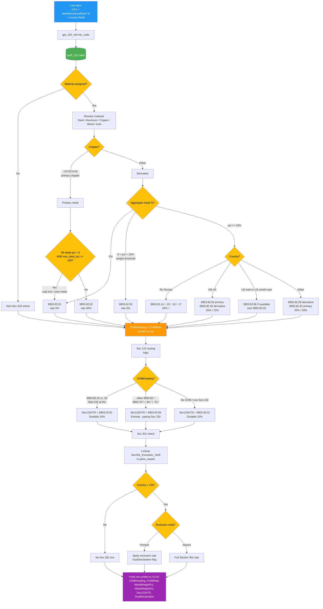

# Section 232 / 301 / 122 Tariff Detection

This flowchart shows how DocHopper classifies each line item and routes it to the correct chapter 99 heading for Section 232 (metals/wood/auto), Section 301 (China-origin), and Section 122 (Reciprocal Tariff).

The routing logic lives in `EnrichmentPipeline.calculate_declarations()` (`Dochopper/ocrmill_enrichment.py`) and the inline Invoice Processing export path (`Dochopper/dochopper.py`).



---

## Section 232 — Note 16 Chapter 99 Routing

Section 232 tariffs apply to steel, aluminum, copper, wood, and automotive articles under Presidential Proclamations 10895/10896 and successor actions. Each affected line gets a **9903.82.XX** chapter 99 heading on the entry.

### Routing decision tree (in order)

| Condition | Ch99 | Rate | Notes |
|---|---|---|---|
| Primary chapter (72/73/74/76), all metal % = 0, `non_steel_pct >= 100` | `9903.82.01` | 0% | Cast iron / zero-metal derivatives in primary chapter (v1.6.15) |
| Derivative chapter, aggregate metal % = 0 | `9903.82.01` | 0% | BIS FRN 2026-08297 zero-metal derivatives |
| Derivative chapter, 0 < metal % < 15 | `9903.82.03` | 0% | Weight-threshold exemption |
| Primary chapter, metal % > 0 | `9903.82.02` | 50% | Standard primary rate |
| Derivative, country = RU | `9903.82.14 / .15 / .16 / .17` | 50%+ | Russia surcharge — table-resolved |
| Aluminum, country = RU | `9903.85.68` | 200% | Russian aluminum |
| Primary, country = GB | `9903.82.04` | 25% | UK exemption (incl. Tata Steel UK with NL melt — CSMS 68554727) |
| Derivative, country = GB | `9903.82.05` | 15% | UK exemption derivative |
| Steel melt = US, or aluminum smelt+cast = US | `9903.82.06` | 10% | US-content reduced rate (when available in tariff_232_ch99) |
| Derivative, metal % >= 15, no other rule | `9903.82.09` | 25% | Standard derivative |

### CBP metal content percentage formula

Per **CSMS #65236645** (June 3, 2025 — aluminum) and **CSMS #65236374** (June 3, 2025 — steel):

```
metal_pct = (manufacturer's acquisition cost for raw metal input) / (entered value per unit) × 100
```

| Component | Definition |
|---|---|
| **Numerator** | Mill invoice price the foreign manufacturer paid to their raw metal supplier |
| **Denominator** | Transaction/entered value — what the US importer pays the manufacturer |
| **Duty base** | `entered_value × (metal_pct / 100)` |

**Numerator must NOT include:** fabrication, machining, labor, surface treatments (anodize/galvanize), paint, coatings, or overhead.

### Entry filing requirements (derivatives)

- Two entry lines:
  - Line 1: Full HTS for the article, non-metal portion value
  - Line 2: Same HTS + chapter 99 code, metal content value, rate per table above
- Both **value (USD)** and **weight (kg)** must be declared
- Duty calculated from value; weight is for audit/verification

### Cast iron exception (v1.6.15)

Cast iron is **not steel** per CBP. Articles in chapter 73 with `non_steel_pct = 100` and all metal % = 0 file under `9903.82.01` at 0% Section 232. But because the article is not paying Section 232 duty, it remains liable for Section 122 (see below) at `9903.03.01` (+10%). See `memory/feedback_confirm_before_github_push.md` and the v1.6.15 release notes.

---

## Section 122 — Reciprocal Tariff Routing (v1.6.14)

Section 122 imposes a baseline 10% reciprocal tariff on most imports, with exemptions for articles already paying Section 232/auto/timber/semiconductor duty.

The per-line `Sec122HTS` column is populated based on the Ch99Heading resolved above:

| Ch99Heading | Sec122HTS | Effect |
|---|---|---|
| `9903.82.01` (zero-metal / cast iron) | `9903.03.01` | Dutiable 10% — Sec 232 filed but at 0%, so Sec 122 still owed |
| `9903.82.03` (<15% weight exemption) | `9903.03.01` | Dutiable 10% — same reasoning |
| Other `9903.82.*` (paying Sec 232) | `9903.03.06` | Exempt — actually paying Sec 232 duty |
| `9903.79.*` (semiconductors) | `9903.03.06` | Exempt — Sec 232 semiconductors |
| `9903.94.*` (autos) | `9903.03.06` | Exempt — Sec 232 auto |
| `9903.76.*` (timber) | `9903.03.06` | Exempt — Sec 232 timber |
| Empty / non-Sec-232 | `9903.03.01` | Default 10% reciprocal tariff |

Reference: NCBFAA Sec. 122 flowchart, April 2026. Local copy: [`tariff-flow-charts-with-section-122.pdf`](tariff-flow-charts-with-section-122.pdf).

---

## Section 301 — China Exclusion Tariffs

Section 301 tariffs apply to goods of Chinese origin under USTR investigation findings.

- `Sec301_Exclusion_Tariff` column in parts_master stores the applicable exclusion code/rate when one applies to that part + HTS
- When `country = CN` AND exclusion is present → reduced/eliminated 301 duty, flagged in `DualDeclaration`
- When `country = CN` AND no exclusion → full Section 301 rate applies
- When `country != CN` → no Section 301 line

Exclusions are product- and HTS-code-specific and have expiration dates. Maintain the `Sec301_Exclusion_Tariff` column with the current value from your broker's tariff data subscription.

---

## Parts Master Fields — Section 232

| Field | Material | Meaning |
|---|---|---|
| `aluminum_pct` | Aluminum | % of entered value that is aluminum content |
| `steel_pct` | Steel | % of entered value that is steel content |
| `copper_pct` | Copper | % of entered value that is copper content |
| `wood_pct` | Wood | % wood content |
| `auto_pct` | Automotive | % classified as automotive under 232 |
| `non_steel_pct` | (residual) | % NOT classified as Sec 232 material — used for cast iron exception |
| `country_of_smelt` | Aluminum | Primary smelt country |
| `country_of_smelt_secondary` | Aluminum | Secondary smelt (dual-source) |
| `country_of_cast` | Aluminum | Country of most recent cast |
| `country_of_melt` | Steel | Country where originally melted and poured |

All country fields stored as ISO 3166-1 alpha-2 codes (`CN`, `IN`, `US`, `GB`, etc.) and normalized via the `country_codes` DB table.

---

## Section 232 Form Extraction (Automatic)

For suppliers who include CBP Section 232 declaration forms inside their PDF packages, templates call `_parse_section_232_tables(tables)` in `extract_all()` to lift values directly:

**Aluminum form (14 cols):**
| Col | Field |
|---|---|
| 1 | SKU / part number |
| 4 | Primary country of smelt |
| 5 | Secondary country of smelt |
| 6 | Most recent cast country |
| 7 | PO value (denominator) |
| 8 | Acquisition cost of aluminum (numerator) |
| 10 | Aluminum weight (kg) |

**Steel form (12 cols):**
| Col | Field |
|---|---|
| 1 | SKU / part number |
| 4 | Country where originally melted and poured |
| 5 | PO value (denominator) |
| 6 | Acquisition cost of steel (numerator) |
| 8 | Steel weight (kg) |

After extraction, a confirmation dialog displays current vs. proposed values before any `parts_master` write occurs (`_ocrmill_show_section_232_dialog()`).

---

## Regulatory References

| Citation | Description |
|---|---|
| CSMS #65236645 | Aluminum derivative valuation guidance (June 3, 2025) |
| CSMS #65236374 | Steel derivative valuation guidance (June 3, 2025) |
| CSMS #68554727 | Annex IV technical corrections — 9903.82.01 zero-metal derivatives, Tata Steel UK NL melt exception (April 29, 2026) |
| BIS FRN 2026-08297 | Effective April 6, 2026 — new 9903.82.01 zero-metal heading |
| NCBFAA Sec. 122 Flowchart | April 2026 reciprocal tariff routing chart |
| Presidential Proclamation 10895 | Section 232 aluminum (50% rate authority) |
| Presidential Proclamation 10896 | Section 232 steel (50% rate authority) |
| CBP Base Metals CEE Memo | Valuation methodology guidance (December 3, 2025) |
