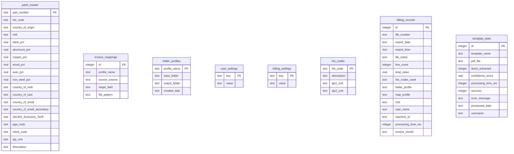

# Application Architecture

This flowchart shows the overall system architecture and component relationships.

```mermaid
flowchart TD
    subgraph UI["User Interface Layer (PyQt5)"]
        A[EntryOps Main Window]
        A --> B[Invoice Processing Tab]
        A --> C[PDF Processing Tab]
        A --> D[Parts View Tab]
        A --> D2[Parts Import Tab]
        A --> E[Menu Bar]
        E --> F[Settings Dialog]
        E --> G[References Dialog]
        E --> H[Account Menu]
        E --> I2[Help Menu]
    end

    subgraph Settings["Unified Settings Dialog"]
        F --> F1[General Page]
        F --> F2[PDF Processing Page]
        F --> F4[Templates Page]
        F --> F5[Database Page]
        F --> F6[Updates Page]
        F --> F7[Authentication Page]
    end

    subgraph Business["Business Logic Layer"]
        B --> I[Invoice Processor]
        C --> J[OCRMill Pipeline]
        D --> K[Parts Manager]
        D2 --> K

        I --> L[Column Mapper]
        I --> M[Value Calculator]
        I --> N[Tariff Classifier]

        J --> O[ProcessorEngine]
        J --> J2[EnrichmentPipeline]
        J --> J3[OCRMillExporter]
        J --> J4[DirectExportWorker]
        O --> P[Template Registry]
        O --> P2[Shared Templates]
    end

    subgraph Data["Data Access Layer"]
        L --> Q[(SQLite Database)]
        M --> Q
        N --> Q
        K --> Q
        P --> R[Local Template Files]
        P2 --> R2[Network Template Files]

        Q --> S[parts_master]
        Q --> T[invoice_mappings]
        Q --> U[user_settings]
        Q --> V[hts_units]
        Q --> V2[folder_profiles]
        Q --> V3[billing_settings]
        Q --> V4[tariff_232]
        Q --> V5[country_codes]
        Q --> V6[cbp_uom_codes]
        Q --> V7[part_number_corrections]
        Q --> V8[billing_records]
        Q --> V9[template_stats]
    end

    subgraph Auth["Authentication Layer"]
        A --> AUTH[AuthenticationManager]
        AUTH --> AUTH1[GitHub API - Remote Users]
        AUTH --> AUTH2[Local auth_users.json Search]
        AUTH --> AUTH3[Network auth_users.json]
        AUTH2 -.->|skips empty files| AUTH3
    end

    subgraph External["External Resources"]
        W[Input Files] --> I
        I --> X[Output Files]
    end

    style A fill:#2196F3,color:#fff
    style Q fill:#4CAF50,color:#fff
    style R fill:#FF9800,color:#fff
    style F fill:#9C27B0,color:#fff
```



## Component Overview

### User Interface Layer

| Component | Description |
|-----------|-------------|
| Main Window | Primary application window with tabbed interface |
| Invoice Processing | Invoice processing and export functionality (CSV/Excel files) |
| PDF Processing (OCRMill) | Template-based PDF invoice extraction with direct XLSX export |
| Parts View | Database management with search, query builder, and editing |
| Parts Import | Dedicated tab for bulk CSV import with column mapping |
| Menu Bar | Settings, References, Account, and Help menus |

### Unified Settings Dialog

All application settings are consolidated in **Settings > Settings**:

| Page | Description |
|------|-------------|
| General | Theme, fonts, row height, MID list |
| PDF Processing | Input/output folders, processing modes, auto-start |
| Templates | Shared templates folder, sync settings |
| Database | Database path, backup settings |
| Updates | Check for updates on startup |
| Authentication | Domain authentication settings |

### Business Logic Layer

| Component | Description |
|-----------|-------------|
| Invoice Processor | Core invoice processing engine (CSV/Excel) |
| Parts Manager | CRUD operations for parts database |
| ProcessorEngine | PDF text extraction + template matching |
| OCR Backend (v1.4.0) | Tesseract fallback when pdfplumber returns empty text; PyMuPDF page render; cached sidecar `<pdf>.ocr.<hash>.txt` |
| EnrichmentPipeline | Parts lookup, material splits, country normalization, Ch99/Sec122 routing, weight allocation |
| OCRMillExporter | Profile-based direct XLSX export |
| DirectExportWorker | Background QThread; parallel extraction, batch pre-flight, validation summary |
| AuthenticationManager | Windows domain auth, remote/local user list resolution, role-based access |
| Column Mapper | Map source columns to target fields |
| Value Calculator | Calculate quantities and distributions |
| Tariff Classifier | Determine Section 232 (9903.82.XX), Section 301, and Section 122 (9903.03.XX) routing |
| Template Registry | Local and shared template auto-discovery |

### Data Access Layer

| Component | Description |
|-----------|-------------|
| SQLite Database | Primary data storage |
| Local Template Files | Python template definitions (editable) |
| Network Template Files | Shared templates from network folder (read-only) |

## Database Schema



## File Structure

```
Entryops/
├── entryops.py           # Main application
├── settings_dialog.py      # Unified settings dialog
├── version.py              # Version management
├── Resources/
│   ├── entryops.db       # SQLite database
│   ├── icon.ico            # Application icon
│   └── References/
│       ├── hts.db          # HTS code reference database
│       └── CBP_232_tariffs.xlsx
├── templates/
│   ├── __init__.py         # Template discovery
│   ├── base_template.py    # Base template class
│   └── *.py                # Custom templates
├── invoice_processor/      # Invoice processing module
├── Input/
│   └── Processed/          # Archived input files
└── Output/
    └── Processed/          # Archived output files
```

## Technology Stack

| Technology | Purpose |
|------------|---------|
| Python 3.12 | Core language |
| PyQt5 | Desktop GUI framework |
| Pandas | Data processing and manipulation |
| SQLite | Embedded database |
| OpenPyXL | Excel file read/write |
| pdfplumber | PDF text extraction (primary) |
| PyMuPDF (fitz) | PDF text extraction (fallback) |
| PyInstaller | Executable packaging |
| Inno Setup | Windows installer |
